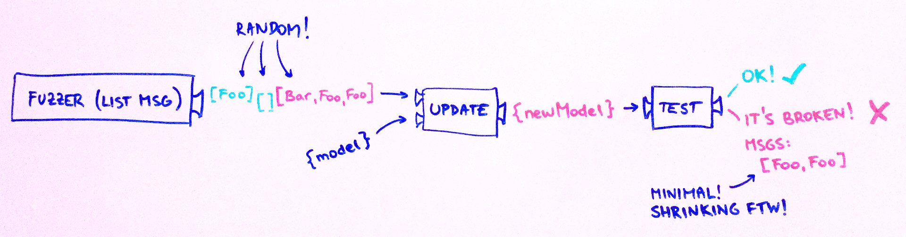

# ArchitectureTest

**tl;dr:** Fuzz-test your `update` function with random `List Msg`s!

To do this, you create a `Msg` fuzzer (and possibly a `Model` fuzzer) and just plug it in!

- [Here's](examples/vending-machine/) an example project with [tests](examples/vending-machine/Tests/VendingMachine.elm).
- A talk about this topic will be presented at [Elm Europe 2017](http://elmeurope.org/).
- For more discussion, see [this issue](https://github.com/elm-community/elm-test/issues/154) of elm-test.
